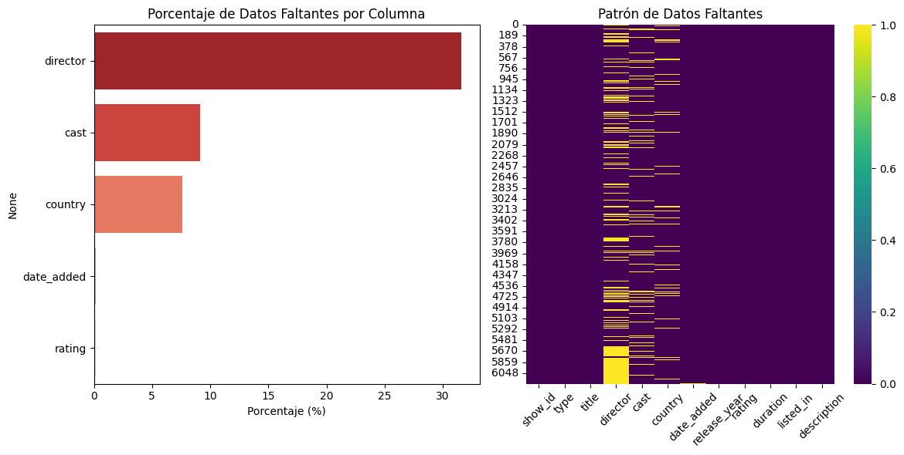
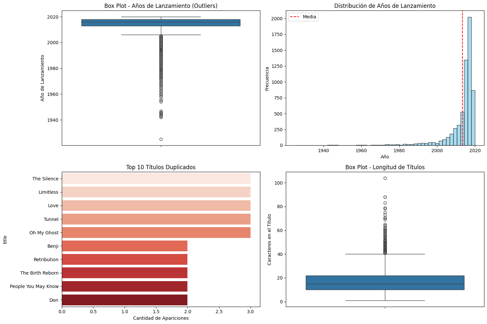
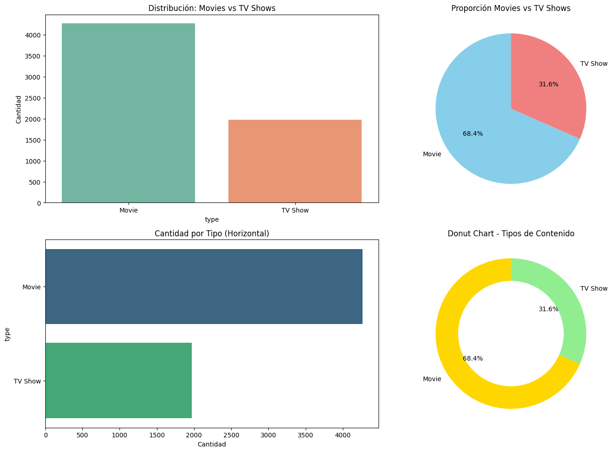
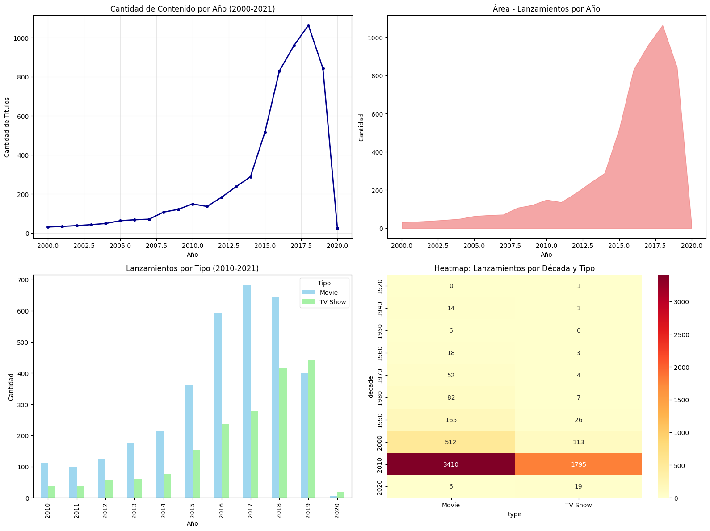
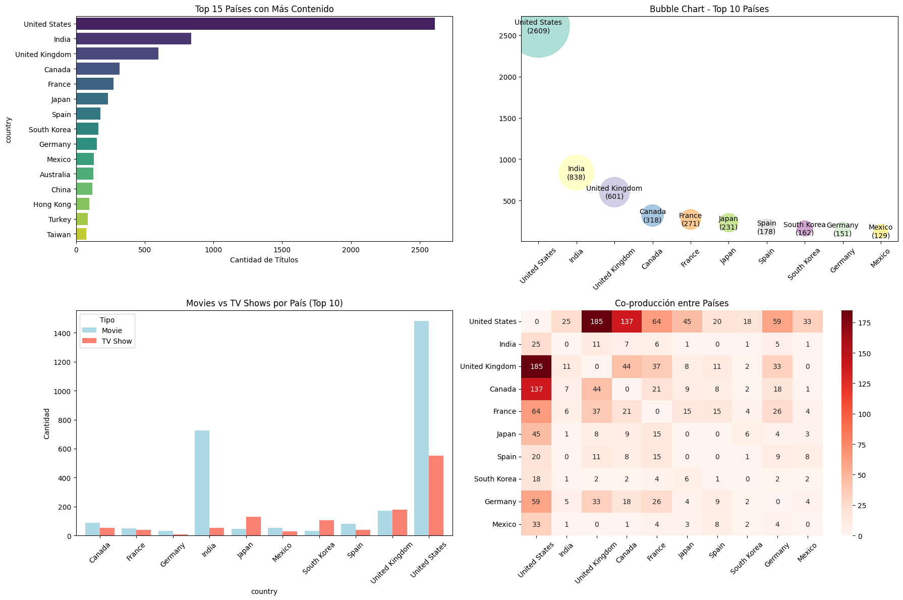
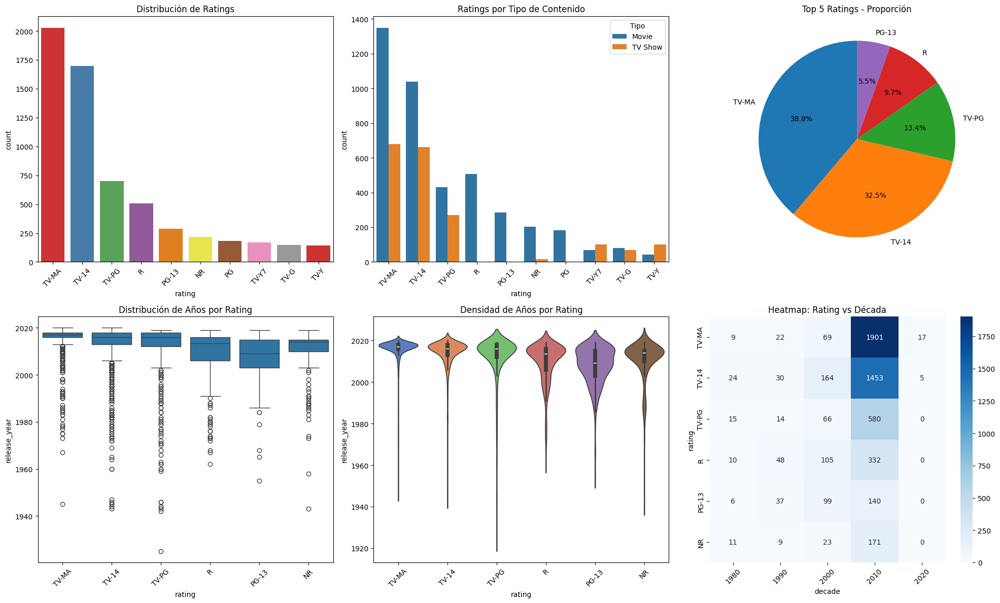
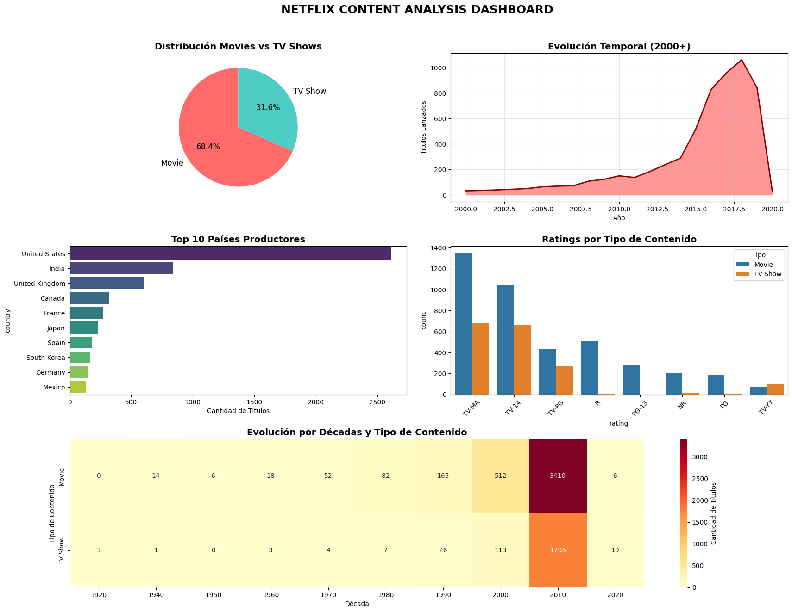

# Análisis Exploratorio de Netflix

## Contexto
Se realizó un análisis exploratorio del dataset público de Netflix, que contiene información sobre películas y series.  
El objetivo fue conocer la estructura de los datos, identificar valores faltantes y obtener visualizaciones descriptivas.

## Objetivos
- Cargar y explorar el dataset de Netflix desde una fuente online.
- Identificar y cuantificar datos faltantes.
- Generar visualizaciones para entender la distribución de variables.

## Actividades (con tiempos estimados)
- Carga y exploración inicial del dataset — 15 min  
- Análisis de valores faltantes — 15 min  
- Visualizaciones exploratorias — 30 min  
- Síntesis de hallazgos — 30 min  

## Desarrollo

**1\. Carga de datos**  

   Se utilizó `pandas` para leer el CSV (`pd.read_csv(url)`)

**2\. Exploración inicial y detección de valores faltantes**  
   
   Con `shape`, `head`, `info` y `describe` se obtuvo un panorama general de las variables y se consultó si había datos faltantes por columna.  

   ```python
   df.dtypes
   df.isna().sum()
   df.isnull().sum().sort_values(ascending=False)
   ```

     
     

**3\. Visualizaciones** 
   
   Con `matplotlib` y `seaborn` se graficó y se exploraron distribuciones de variables (`sns.histplot`, `sns.countplot`, `sns.boxplot`).  

   - Se contaron las frecuencias de cada categoría.  
   - Distribuciones por categoría:  
       
   - Tendencias temporales:  
       

**4\. Análisis de países con visualizaciones**  

   - Los 5 países con mayor contenido son:  

     ```
     United States     2609
     India              838
     United Kingdom     601
     Canada             318
     France             271
     ```

       

   - Los 5 ratings más comunes son:  

     ```
     TV-MA    2027
     TV-14    1698
     TV-PG     701
     R         508
     PG-13     286
     ```

       

**5\. Dashboard interactivo**  
   
     

**6\. Se respondieron preguntas adicionales en el notebook**  
   
   Para finalizar se respondieron preguntas de análisis más profundo, las cuales fueron anexadas en la entrada del código.  

## Evidencias
- Notebook del análisis: [entrega_dos.ipynb](dos.ipynb)  

## Reflexión
Aprendizaje: recordé funciones de pandas, matplotlib y seaborn y aprendí características de EDPA.  
Próximos pasos: análisis con mayor profundidad, con datos actualizados y mayor cantidad de variables.  

## Conclusión
El análisis exploratorio me permitió validar el dataset de Netflix, con datos que nos permitieron trabajar y practicar (valores faltantes y variables confusas). Aun con esto, se identificaron tendencias como el crecimiento sostenido de producciones en las últimas dos décadas y el predominio de películas sobre series.  

## Referencias 
- Dataset: [Netflix Shows (Kaggle)](https://www.kaggle.com/shivamb/netflix-shows)  
- [Documentación de pandas](https://pandas.pydata.org/docs/)  
- [Documentación de seaborn](https://seaborn.pydata.org/)  

