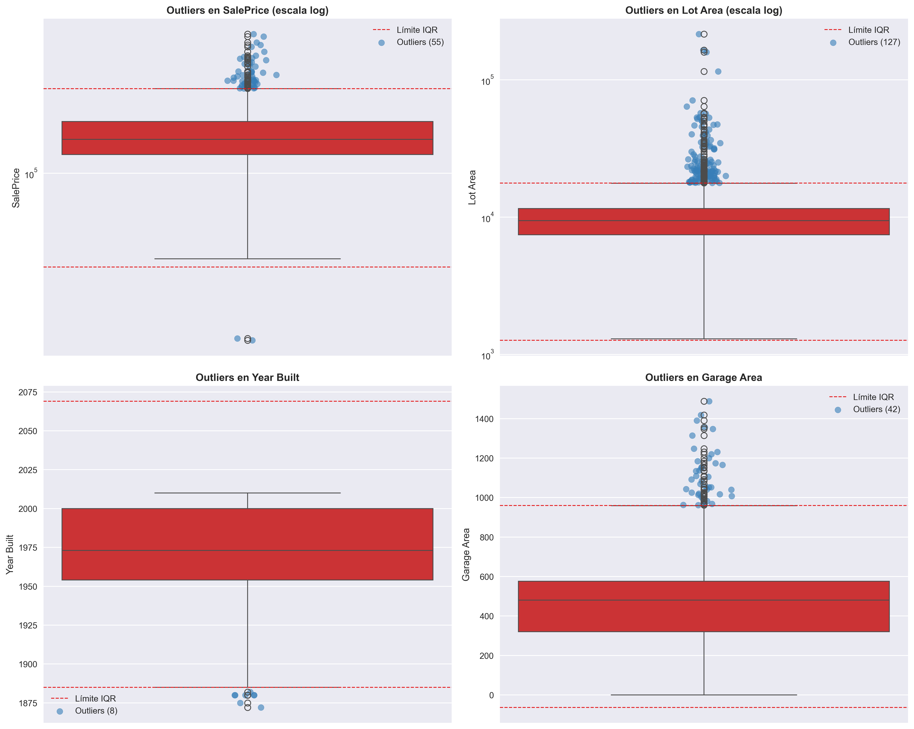
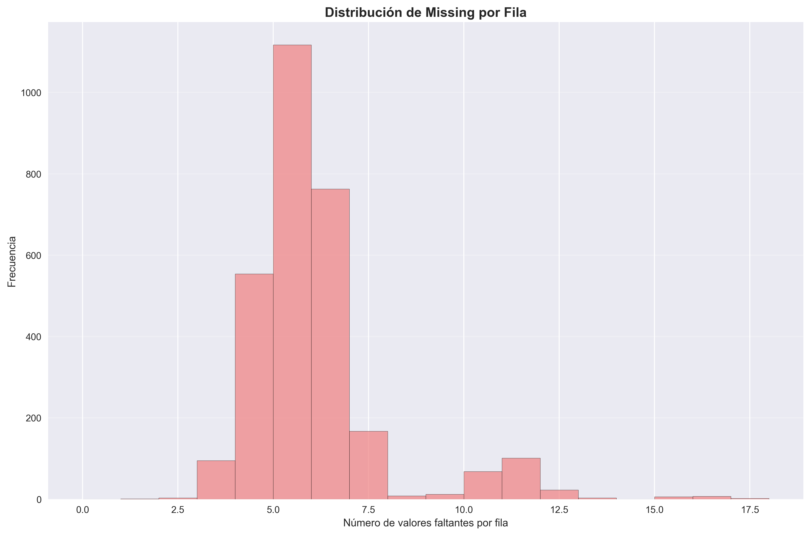
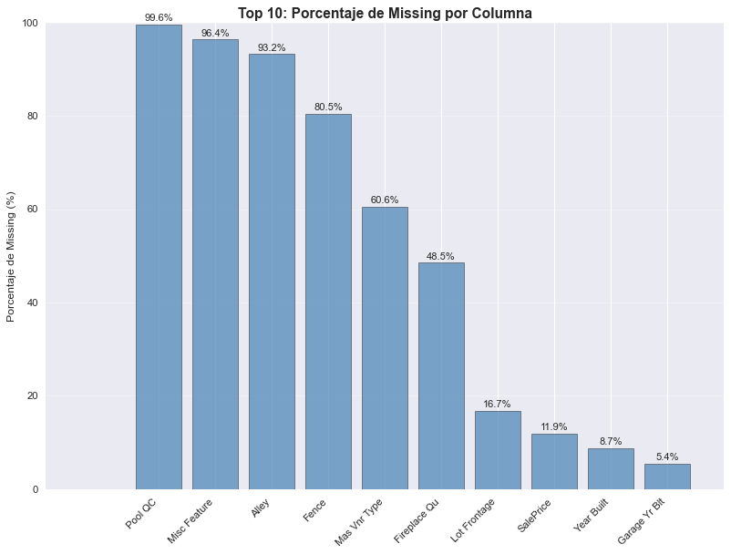
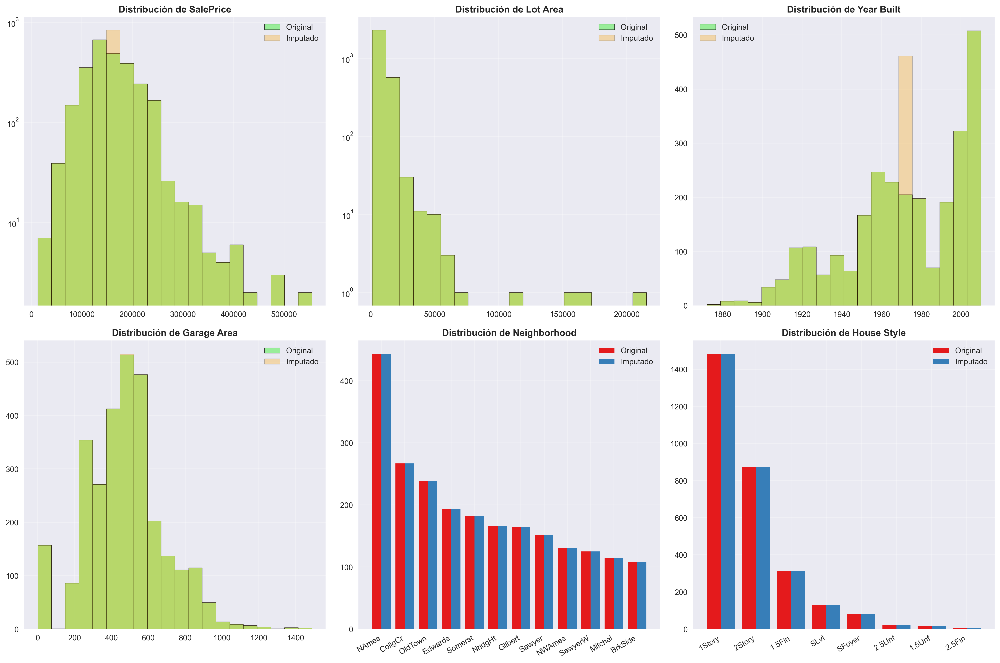
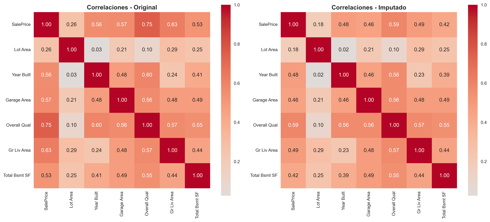

# Limpieza y preparación del dataset Ames Housing: outliers, missing y pipelines

## Contexto

El análisis se realizó sobre el dataset **AMES Housing**, con el objetivo de estudiar la calidad de los datos, detectar outliers, implementar estrategias de imputación y preparar un pipeline reproducible para futuros modelos predictivos.
El dataset Ames Housing es ampliamente utilizado para enseñanza de modelado predictivo. Este análisis se centró en preparar datos confiables para futuros modelos de precios de viviendas, aplicando detección de outliers, imputaciones inteligentes y creación de un pipeline reproducible.

## Objetivos

* Detectar y cuantificar valores atípicos (outliers) con distintos métodos.  
* Identificar tipos de missing data (MCAR/MAR/MNAR) y definir estrategias de imputación.  
* Comparar distintas técnicas de imputación (media, mediana, moda).  
* Validar el efecto de las imputaciones en distribuciones y correlaciones.  
* Implementar un pipeline con sklearn.

## Actividades

* Detección de outliers — 15 min  
* Visualización de distribuciones y outliers — 15 min  
* Estrategias de imputación simples (mean, median, mode) — 15 min  
* Imputación condicional por grupos — 15 min  
* Verificación — 10 min  
* Comparación de distribuciones y correlaciones — 15 min  
* Creación de pipeline de limpieza reproducible — 15 min  

## Desarrollo

**1\. Detección de Outliers**  
   
   * Métodos aplicados: **IQR** (distribuciones sesgadas) y **Z-Score** ( distribuciones normales).  
   * Se cuantificaron outliers en columnas clave.
   * Se visualizaron mediante **boxplots** con límites IQR y dispersión logarítmica en variables sesgadas.
   * Resultados:  
   
      Total de outliers detectados: 3365.0
      Porcentaje promedio de outliers: 2.94%
      Columna con más outliers: 459.0

      SalePrice:
      IQR outliers: 55 (1.9%)
      Z-Score outliers: 29 (1.0%)

      Lot Area:
      IQR outliers: 127 (4.3%)
      Z-Score outliers: 29 (1.0%)

      Year Built:
      IQR outliers: 8 (0.3%)
      Z-Score outliers: 7 (0.2%)

      Garage Area:
      IQR outliers: 42 (1.4%)
      Z-Score outliers: 17 (0.6%)

 

**2\. Análisis de Missing Data**  
   
   
   

   * Clasificación preliminar de missing:  

     - *Year Built*: tendencia a ser **MAR**.  
     - *Garage Area/Type*: **MNAR**.  
     - *SalePrice*: sin faltantes detectados.  
     - Variables categóricas: faltantes mínimos.  

**3\. Estrategias de Imputación**  
   
   * **Numéricas**: media, mediana, moda según distribución.  
   * **Categóricas**: moda o “Unknown”.  
   * **Smart Imputation**:  
     - `Year Built` → mediana  
     - `Garage Area` → indicador si no hay garaje o mediana de barrio 
     - `SalePrice` → mediana por barrio  
     - `Garage Type` → moda 

**4\. Anti-Leakage y Validación**  
   
   * Se aplicó split en Train/Valid/Test antes de imputar.  
   * Imputers ajustados solo con Train y aplicados al resto.  

   * Resultados:
  
      SPLIT DE DATOS 

         Train: 1758 registros
         Valid: 586 registros
         Test: 586 registros
         Columnas numéricas: 38
         Columnas categóricas: 43
         Anti-leakage aplicado: fit solo en train, transform en todo

**5\. Comparación de distribuciones y correlaciones**  
   Histogramas y barras compararon datos y heatmaps de correlaciones mostraron diferencias chicas:
    
     
  
**6\. Pipeline reproducible**  
   
   * Construcción de un **ColumnTransformer + Pipeline** en sklearn.  
   * Incluyó imputación (median, most_frequent), escalado (StandardScaler) y codificación categórica (OneHotEncoder).  
   * Resultados:

      Shape antes del pipeline: (2930, 82)

      Shape después del pipeline: (2930, 46)

**7\. Se respondieron preguntas adicionales en el notebook.** 
   
   Para finalizar se respondieron preguntas de análisis más profundo, las cuales fueron anexadas en la entrada del código. Las mismas pueden verse allí mismo.

## Evidencias

* Notebook del análisis: **[04 - AMES valores faltantes.ipynb](cuatro.ipynb)**
    
## Reflexión

**Aprendizajes**:  

  - Importancia de distinguir entre tipos de missing data (MCAR/MAR/MNAR).  
  - Diferencia entre métodos de outlier detection (IQR vs Z-Score).  
  - Uso de estrategias de imputación (por grupo, luego global).  
  - Necesidad de pipelines para reproducibilidad y evitar data leakage.  

**Siguientes pasos**:  

  - Testear métodos más avanzados.  
  - Integrar este pipeline en un flujo completo de modelado (regresión o árboles).  

## Conclusión

El dataset quedó **limpio, imputado y con outliers caracterizados**, listo para usar en un modelo predictivo confiable. Se documentaron todas las decisiones y se consolidó un **pipeline**.

## Referencias

* scikit-learn pipelines — [https://scikit-learn.org/stable/modules/compose.html](https://scikit-learn.org/stable/modules/compose.html)  

