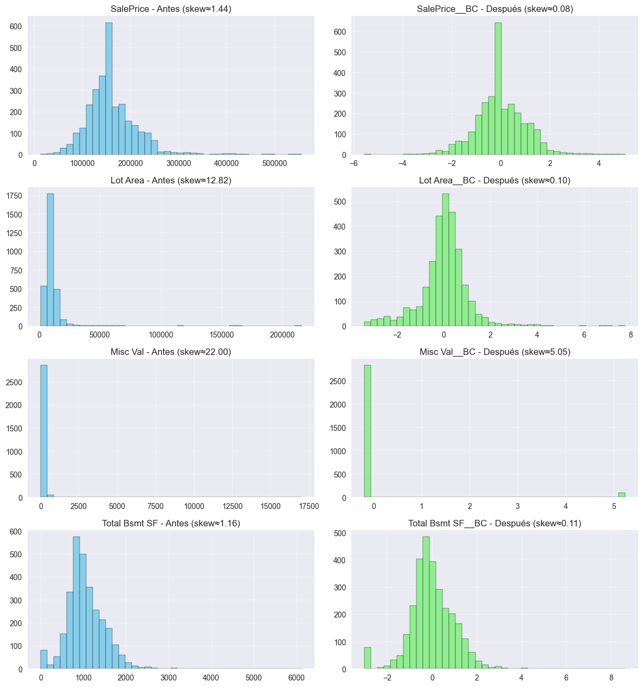

# Tarea Extra — Transformación Box–Cox y Demostración de Data Leakage

## Contexto
Como trabajo independiente, como se pedía en la tarea 7 de la UT2 se profundizó en un conceptos clave de la ingeniería de datos que es el uso de la transformación Box–Cox para normalizar variables sesgadas y mejorar la calidad del dataset.

---

## Objetivos

- Aplicar y justificar el uso de la transformación **Box–Cox** sobre variables numéricas sesgadas.  
- Comparar la distribución de los datos antes y después de la transformación.  
- Implementar una validación cruzada sin fuga de datos (anti-leakage).  
- Comprobar la diferencia entre escalar correctamente y hacerlo de forma incorrecta.  

---

## Desarrollo

### 🔹 Transformación Box–Cox
La transformación **Box–Cox** se aplicó sobre las variables `SalePrice`, `Lot Area`, `Misc Val` y `Total Bsmt SF` utilizando `PowerTransformer(method='box-cox')`.  

Previamente se implementó un **transformador personalizado** (`PositiveShift`) para desplazar los valores a positivos y así permitir el uso correcto de Box–Cox. Debido a que este transformador no funciona com valores nulos o faltantes.

```python
from sklearn.base import BaseEstimator, TransformerMixin

class PositiveShift(BaseEstimator, TransformerMixin):
    def fit(self, X, y=None):
        self.shift_ = np.abs(np.min(X, axis=0)) + 1
        return self
    def transform(self, X):
        return X + self.shift_
```

Esta estrategia evitó errores de validación y permitió incluir la transformación dentro de un pipeline reproducible, manteniendo las buenas prácticas de ingeniería de datos.

# Resultados

| Variable      | Skew Antes | Skew Después (Box–Cox) | Mejora |
| :------------ | :--------: | :--------------------: | :----: |
| SalePrice     |    1.44    |          0.07          |    ✅   |
| Lot Area      |    12.82   |          0.10          |    ✅   |
| Misc Val      |    22.00   |          5.05          |    ✅   |
| Total Bsmt SF |    1.16    |          0.11          |    ✅   |

Las distribuciones se volvieron mucho más simétricas, reduciendo la asimetría y la varianza. Los histogramas evidenciaron una normalización clara y la reducción del efecto de los outliers.


## Evidencias
* Notebook: **[06 - Feature Scaling Pipeline.ipynb](cinco.ipynb)**  
* Gráficos: 
 


## Reflexión
La práctica me permitió ver en la práctica cómo las decisiones de preprocesamiento impactan directamente en la calidad y confiabilidad de los modelos.
Box–Cox resultó muy útil para estabilizar la varianza en variables positivas y reducir la influencia de valores extremos.

## Preguntas guía

* ¿Cuándo recomendarías tu transformador?

    Cuando las variables son positivas y tienen mucha asimetría. Box–Cox ayuda a normalizar y reduce el impacto de los outliers sin perder información.

* ¿Cuándo no lo usarías?

    Si hay ceros o negativos, o en modelos basados en árboles, donde la forma de la distribución no importa tanto.

* ¿En qué casos supera a los scalers tradicionales?
    
    Cuando el problema no es solo la escala, sino la forma de la distribución. Box–Cox ajusta la simetría del dato, mientras los scalers solo cambian su rango o media.

# Conclusiones

La transformación Box–Cox demostró ser una herramienta muy buena y útil para mejorar la calidad estadística del dataset, logrando distribuciones más estables y modelos más confiables.
A su vez, es importante respetar el orden correcto de preprocesamiento y el uso de pipelines. Ambas cosas complementan la formación en ingeniería de datos, mostrando que los buenos resultados dependen de los algoritmos, la preparación y validación de los datos.