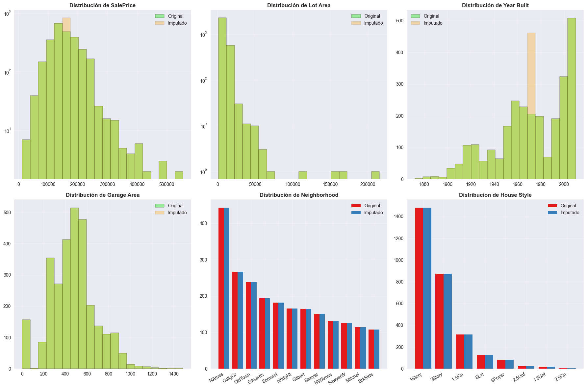

# Missing Data Detective: analizando outliers y datos faltantes en Ames Housing

## Contexto

En esta entrega se trabajó con el dataset Ames Housing, que contiene información detallada sobre precios y características de viviendas. El objetivo fue estudiar la presencia de datos faltantes y outliers, identificar su impacto en el modelado y diseñar estrategias de imputación y limpieza que mantengan la integridad del dataset.

Este análisis también incluyó una mirada ética sobre el tratamiento de los datos, reflexionando sobre las implicancias de modificar o eliminar observaciones que podrían representar casos reales con valor analítico.

## Objetivos

* Aprender a detectar y analizar datos faltantes (MCAR, MAR, MNAR)
* Identificar outliers usando métodos estadísticos
* Implementar estrategias de imputación apropiadas
* Crear pipelines de limpieza reproducibles
* Considerar aspectos éticos en el tratamiento de datos

## Actividades

* Setup y Carga de Datos — 10 min  
* Cargar y Crear Missing Data Sintético — 10 min  
* Hacer un análisis inicial del dataset — 15 min  
* Detectar patrones de Missing Data y clasificar tipos de Missing Data — 15 min  
* Detección de outliers (coon y sin z-score) — 15 min  
* Visualización de outliers y estrategias de imputación — 15 min  
* Anti-Leakage Básico y análisis de Impacto de la Imputación — 15 min 
* Pipeline de Limpieza Reproducible - 10 min
* Conclusiones finales - 20 min 

## Desarrollo

**1\.Análisis inicial del dataset**  
Se cargó el dataset Ames Housing, verificando su estructura y los tipos de datos.  
Se detectaron columnas numéricas y categóricas con valores faltantes.

**2\. Detección de Missing Data**  
Con `df.isna().sum()` se cuantificaron los valores faltantes. Se identificaron patrones MAR y MNAR.

**3\. Detección de outliers**
Se aplicaron los métodos **IQR** y **Z-Score** sobre variables continuas.  
El 2,9 % de los registros presentaron valores atípicos significativos.

**4\. Imputación y validación** 
Se implementaron estrategias de imputación:
- Media o mediana según distribución.  
- Moda o "Unknown" para categóricas.  

**5\. Anti-Leakage**  
Las imputaciones se realizaron únicamente sobre el set de entrenamiento, evitando el data leakage en validación y test.

**6\. Pipeline reproducible** 
Se construyó un ColumnTransformer + Pipeline con `sklearn`, que integró imputación, codificación y escalado.  
   
**7\. Se respondieron preguntas adicionales en el notebook.** 
   

## Evidencias

* Notebook del análisis: **[05 - AMES valores faltantes.ipynb](../tareas_obligatorias/cinco.ipynb)**
* Gráficos: 
  
 

## Reflexión
El ejercicio reafirmó la importancia de comprender por qué los datos faltan antes de decidir cómo tratarlos.  
Además, trabajar con anti-leakage reforzó buenas prácticas de ingeniería de datos, mostrando que la limpieza debe ser tanto técnicamente correcta como éticamente responsable.

---

## Conclusión
El dataset quedó limpio, imputado y con outliers caracterizados. Se documentaron todas las decisiones y se consolidó un pipeline reproducible, listo para entrenamiento de modelos predictivos confiables.

