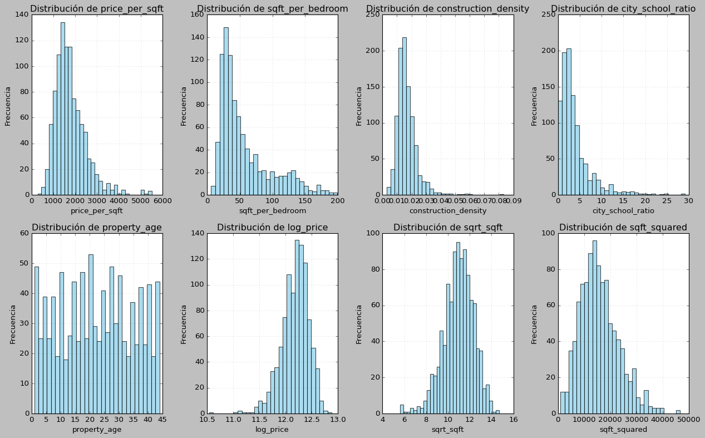
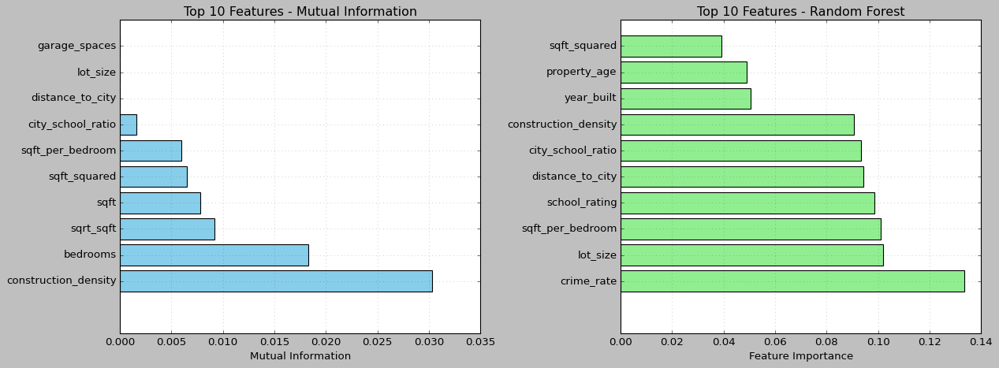
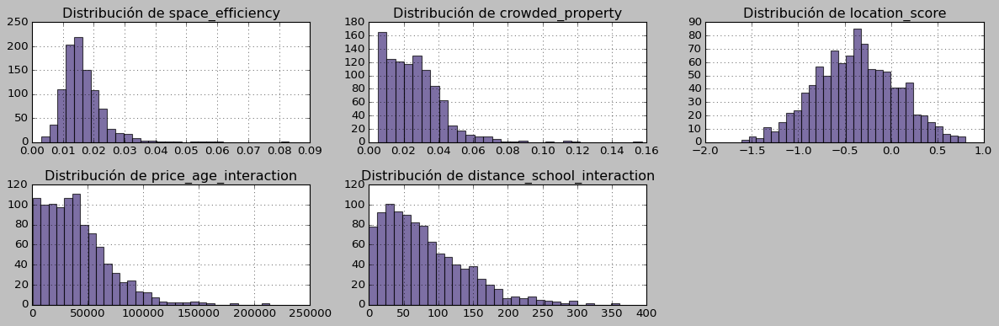

# Creación de nuevas variables y evaluación de su relevancia en un dataset de viviendas

## Contexto

En esta práctica se trabajó con un dataset sintético de viviendas, con precios y características como superficie, número de habitaciones, baños, antigüedad, tamaño del terreno, cercanía a la ciudad, calidad escolar, entre otras.  
El objetivo fue aplicar técnicas de Feature Engineering para crear, transformar y evaluar nuevas variables con potencial predictivo sobre el precio de las propiedades.

## Objetivos
* DETECTAR sesgo histórico en datasets reales (Boston Housing + Titanic)
* ANALIZAR impacto del sesgo en predicciones de modelos
* COMPARAR estrategias: detección (regresión) vs corrección (clasificación)
* EVALUAR cuándo detectar vs cuándo intentar corregir automáticamente
* DESARROLLAR criterios éticos para deployment responsable
* REFLEXIONAR sobre la creación de variables propias basadas en conocimiento del dominio.

## Actividades
* Setup y Carga de Datos - 5 min
* Crear Dataset Sintético y Features Derivadas - 10 min
* Análisis de Distribución de Features — 25 min
* Evaluación de Importancia de Features - 10 min
* Investigación Libre - 15 min
* Aplicar con AMES - 30 min  
* Investigación libre con features propias — 20 min  

## Desarrollo

**1\. Generación del dataset sintético**

Se creó un dataset de 1000 viviendas con variables numéricas y categóricas simuladas.  
Se revisaron estadísticas básicas y se aseguraron valores positivos.  
Las columnas incluyeron `price`, `sqft`, `bedrooms`, `bathrooms`, `year_built`, `garage_spaces`, `lot_size`, `distance_to_city`, `school_rating` y `crime_rate`.

  

**2\. Creación de nuevas features**

Se aplicaron diferentes estrategias:

- **Ratios y proporciones:**  
  - `price_per_sqft` (precio por m²)  
  - `sqft_per_bedroom` (superficie por habitación)  
  - `mi_ratio_1` (superficie/lote)  
  - `mi_ratio_2` (distancia a ciudad / rating escolar)

- **Variables temporales:**  
  - `property_age` (antigüedad de la propiedad)  
  - `age_category` (clasificación en antiguo, moderno o nuevo)  
  - `is_new_property` (binario para propiedades nuevas)

- **Transformaciones matemáticas:**  
  - `log_price`, `sqrt_sqft`, `sqft_squared`  

- **Features compuestas:**  
  - `luxury_score` (precio + superficie + amenities)  
  - `location_score` (relación entre distancia, rating escolar y crimen)

**3\. Análisis de distribución y detección de outliers**

Se visualizaron histogramas de las nuevas variables para verificar su comportamiento.  
Se aplicó el método IQR (Interquartile Range) para detectar valores atípicos en `price_per_sqft`, `sqft_per_bedroom` y `property_age`.  
Los outliers representaron entre 3 y 5 % de las observaciones, sin afectar la estructura general del dataset.

**4\. Evaluación de importancia de las features**

- **Mutual Information (MI)** para relaciones no lineales.  
- **Random Forest Feature Importance** para medir relevancia predictiva.

Las variables con mayor peso fueron `sqft`, `log_price`, `price_per_sqft` y `property_age`.

**5\. Investigación libre y features propias**

Se generaron nuevas variables personalizadas para explorar hipótesis:  

- `space_efficiency` (superficie/lote)  
- `crowded_property` (habitaciones/superficie)  
- `location_score` (combinación de crimen, escuela y distancia)  

Ninguna mostró correlaciones fuertes con el precio, aunque se destacaron como intentos valiosos para captar factores más abstractos del valor inmobiliario.

**6\. Prueba con datos reales (Ames Housing)**

Se aplicaron las mismas técnicas al dataset Ames Housing, observando diferencias entre datos simulados y reales.  
Las variables relacionadas con tamaño, antigüedad y amenities fueron las más consistentes y predictivas.

## Evidencias

- Notebook del trabajo: [entrega_ocho.ipynb](../tareas_obligatorias/ocho.ipynb)  

## Reflexión

Aprendí a crear nuevas variables que mejoran la interpretación y el potencial predictivo de los datos.  
Comprendí la importancia de utilizar conocimiento del dominio para generar features significativas y no solo aumentar la cantidad.  
También confirmé que técnicas como Mutual Information permiten descubrir relaciones no evidentes para los modelos lineales.

## Conclusión

El Feature Engineering es una etapa central del preprocesamiento, donde la creatividad y el criterio técnico definen la calidad del modelo.  
Este trabajo permitió practicar la creación de ratios, transformaciones y evaluaciones, consolidando habilidades esenciales para el modelado supervisado.
