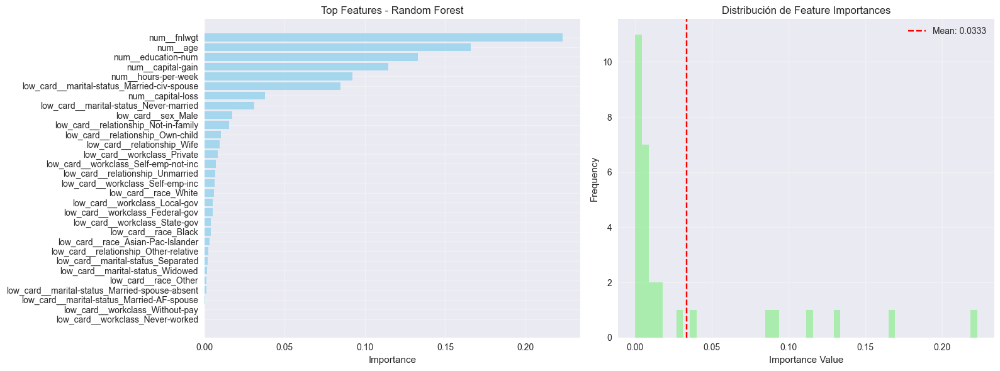
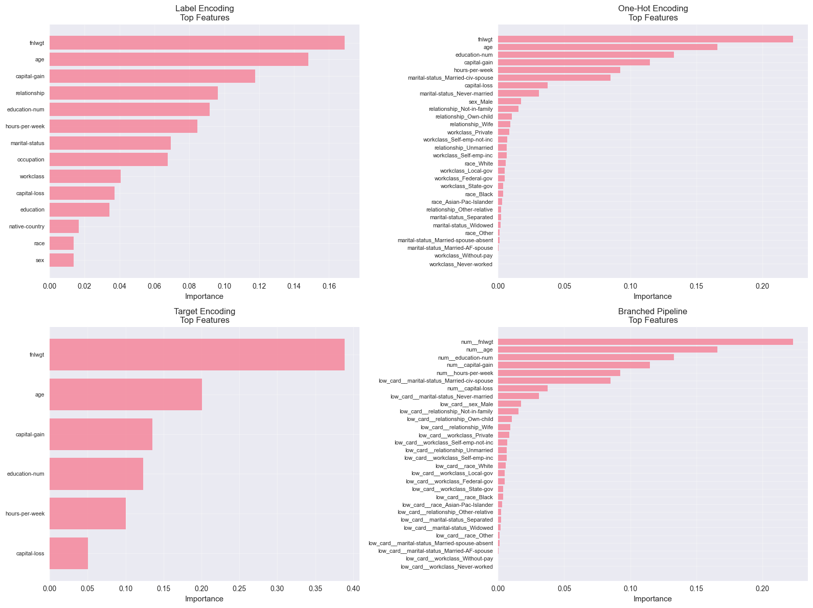

# Codificación de variables categóricas en el dataset Adult Income 

## Contexto

Se trabajó con el dataset Adult Income del repositorio UCI, para que  predecir si una persona gana más de 50 K dólares al año según sus características demográficas y laborales.  
El objetivo fue aplicar técnicas avanzadas de codificación de variables categóricas, comparando sus resultados y eficiencia.  
El trabajo permitió explorar los problemas de cardinalidad, la explosión dimensional del One-Hot Encoding y el impacto de distintas estrategias en el rendimiento del modelo.

## Objetivos

- Cargar y limpiar el dataset Adult Income.  
- Analizar la cardinalidad de las variables categóricas.  
- Aplicar y comparar distintos métodos de encoding (Label y One-Hot).  
- Evaluar métricas de rendimiento y tiempo de entrenamiento.

## Actividades (con tiempos estimados)

- Carga y limpieza del dataset — 20 min  
- Análisis de cardinalidad — 20 min  
- Implementación de Label Encoding — 25 min  
- Implementación de One-Hot Encoding — 25 min  
- Evaluación y comparación — 20 min  

## Desarrollo

**1\. Carga y limpieza de datos**

Se importó el dataset desde la URL oficial del UCI Repository y se asignaron nombres a las columnas.  
Se eliminaron valores faltantes y espacios en blanco de las categorías.  
Finalmente se creó una variable `target` que indica si el ingreso supera los 50 K.  
El dataset resultante tuvo más de 30 000 registros.

**2\. Análisis de cardinalidad**

Se identificaron 13 variables categóricas, clasificadas por número de categorías:  
- Baja cardinalidad (≤10): por ejemplo `sex`, `relationship`, `race`.  
- Media (11–50): `occupation`, `workclass`.  
- Alta (>50): `native-country`.  

 

**3\. Label Encoding**

Se aplicó LabelEncoder a todas las variables categóricas, reemplazando cada categoría por un número entero.  
Luego se entrenó un Random Forest sobre las variables transformadas.  
Los resultados obtenidos fueron:  
- Accuracy **0.84**  
- AUC-ROC **0.90**  
- F1-Score **0.64**  

**4\. One-Hot Encoding y Random Forest**

Para evitar el aumento excesivo de dimensiones, se aplicó One-Hot Encoding solo a las variables de baja cardinalidad. Se volvió a entrenar el Random Forest con las columnas codificadas y las variables numéricas.  
Los resultados se mantuvieron similares (Accuracy ≈ **0.85**, AUC-ROC ≈ **0.90**), pero con un **mayor número de features**, lo que implicó más tiempo de entrenamiento.

 
 

**5\. Conclusiones intermedias**

- One-Hot funciona bien con pocas categorías, pero no escala a variables con decenas de valores únicos.  
- Label Encoding es más eficiente, aunque introduce relaciones numéricas ficticias.  

## Evidencias

- Notebook de la práctica: [entrega_nueve.ipynb](../tareas_obligatorias/nueve.ipynb)  

## Reflexión

Aprendí a manejar datasets reales con muchas variables categóricas y a reconocer los límites de cada tipo de encoding.  
Comprendí cómo la cardinalidad influye directamente en la dimensionalidad y en el tiempo de entrenamiento. Como mejora futura, me gustaría probar Target Encoding para medir su impacto en la performance.

## Conclusión

El trabajo permitió entender de forma práctica cómo distintos métodos de codificación afectan el rendimiento de un modelo de clasificación.  
El análisis demostró que no existe un método único: la elección depende del balance entre precisión, interpretabilidad y recursos computacionales.

## Referencias

- Dataset: [Adult Income – UCI Machine Learning Repository](https://archive.ics.uci.edu/ml/datasets/adult)  
- [Documentación de scikit-learn](https://scikit-learn.org/stable/)  
- [category_encoders](https://contrib.scikit-learn.org/category_encoders/)

