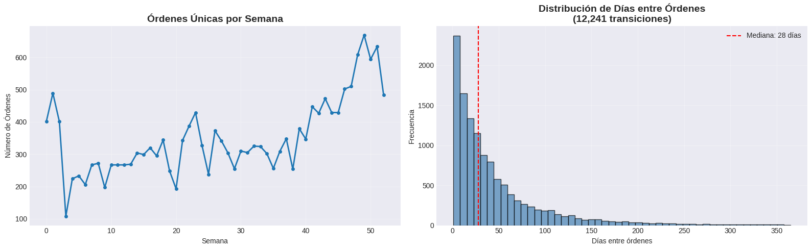
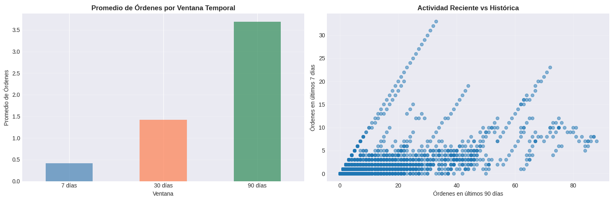

# Análisis temporal de comportamiento de usuarios y creación de features derivadas

## Contexto

En esta práctica se trabajó con el dataset Online Retail de Kaggle, que contiene transacciones de compras en línea realizadas por clientes durante el período 2010–2011.  
El objetivo fue explorar patrones temporales en el comportamiento de compra y crear variables que representen la frecuencia, recurrencia y hábitos de los usuarios a lo largo del tiempo.

## Objetivos

- Cargar y limpiar un dataset transaccional real.  
- Comprender la estructura temporal de los datos y evitar data leakage.  
- Crear variables de tiempo a nivel de transacción y de usuario.  
- Calcular intervalos entre compras y frecuencia de pedidos.  
- Analizar la distribución de compras en el tiempo y por día/hora.  
- Preparar un dataset agregado por usuario para modelado predictivo.

## Actividades

- Setup y carga de datos — 10 min  
- Limpieza y preparación del dataset — 20 min  
- Creación de columnas derivadas y variables temporales — 30 min  
- Agregación a nivel de usuario y análisis — 25 min  
- Visualización y conclusiones — 15 min  

## Desarrollo

**1\. Carga y exploración del dataset**

Se descargó el dataset Online Retail desde Kaggle mediante la API.  
Contiene información de facturas, productos, cantidades, precios y clientes.  
Se cargó en Pandas y se exploró su estructura, tipos de variables y rango temporal.  
El rango de fechas abarca de diciembre de 2010 a diciembre de 2011, con más de 500 000 transacciones.

**2\. Limpieza y preparación de datos**

Se eliminaron:
- Filas con `CustomerID` nulo.  
- Facturas canceladas.  
- Registros con cantidades o precios menores o iguales a cero.  

Luego se renombraron columnas y se creó la variable `total_amount`.  
Los datos se ordenaron cronológicamente por `user_id` y `order_date`.

**3\. Exploración temporal**

Se analizó la estructura temporal del dataset.
- Se calcularon métricas globales:
  - Promedio de órdenes por usuario: 5  
  - Promedio de ítems por orden: 4  
  - Promedio de precio por ítem: 3,5 

**4\. Creación de features temporales**

Se generaron variables a nivel de transacción:
- `order_dow`: día de la semana (0 = lunes, 6 = domingo)  
- `order_hour_of_day`: hora del día de la compra  

Posteriormente se agregaron a nivel de orden, obteniendo una fila por factura:
- `cart_size`: cantidad total de ítems en la orden  
- `order_total`: gasto total  
- `order_number`: número secuencial de compra por usuario  
- `days_since_prior_order`: días transcurridos desde la compra anterior  

**5\. Visualización y análisis**

Se realizaron dos gráficos principales:
- **Órdenes únicas por semana**, mostrando picos de actividad en diciembre.  
- **Distribución de días entre órdenes**, con una mediana de **8 días** entre compras.  
  

 

 

**6\. Dataset final**

El dataset agregado (`orders_df`) contiene:
- Más de 20 000 órdenes únicas.  
- Usuarios recurrentes
- Variables útiles para modelar recompra o segmentación.  

## Evidencias

- Notebook del trabajo: [entrega_once.ipynb](../tareas_obligatorias/once.ipynb)  

## Reflexión

Aprendí a preparar y analizar datos temporales a partir de registros transaccionales.  
Comprendí cómo evitar data leakage y la importancia de ordenar los eventos antes de crear variables dependientes del tiempo.  
También practiqué el uso de `groupby`, `shift` y `diff` para calcular diferencias temporales entre eventos de cada usuario.

## Conclusión

Las temporal features permiten capturar el ritmo de interacción de los usuarios con el sistema y aportan un valor significativo para modelos de predicción de comportamiento.  
Este trabajo reforzó la comprensión del flujo temporal en los datos y la forma correcta de generar variables.

## Referencias

- Dataset: [Online Retail Dataset (Kaggle)](https://www.kaggle.com/datasets/vijayuv/onlineretail)  
- [Documentación Pandas – Time Series / Shift / Diff](https://pandas.pydata.org/pandas-docs/stable/user_guide/timeseries.html)  
- [Scikit-learn: Time Series Split](https://scikit-learn.org/stable/modules/generated/sklearn.model_selection.TimeSeriesSplit.html)
