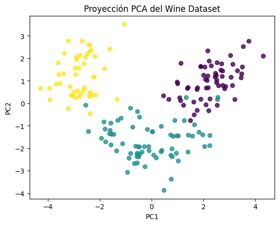

# Evaluación de importancia de variables y reducción de dimensionalidad

## Contexto

En esta práctica se exploraron métodos para evaluar la relevancia de las variables y aplicar reducción de dimensionalidad mediante PCA. Se utilizó el dataset Wine de Scikit-learn, que contiene mediciones físico-químicas de distintos tipos de vino.

## Objetivos

- Calcular la importancia de las variables con Random Forest.  
- Aplicar PCA para reducir dimensiones conservando la varianza.  
- Analizar las relaciones entre los componentes principales.  
- Visualizar la estructura de los datos en el espacio reducido.  

## Actividades

- Carga y normalización de datos — 10 min  
- Entrenamiento de modelo y cálculo de importancia — 15 min  
- Aplicación de PCA — 15 min  
- Visualización y análisis — 10 min  

## Desarrollo

Se escalaron las variables numéricas y se entrenó un modelo Random Forest Classifier para determinar la importancia de las features.  
Las más influyentes fueron `color_intensity`, `flavanoids`, `proline`, `alcohol` y `od280/od315_of_diluted_wines`.

Luego se aplicó PCA con 2 componentes, conservando el 95 % de la varianza explicada.  
La visualización de los componentes principales mostró una clara separación entre las tres clases de vino.

  

## Evidencias

- Notebook: [tarea_extra_2.ipynb](../tareas_extras/tarea_extra_dos.ipynb)  

## Reflexión

Aprendí a utilizar el PCA como herramienta para reducir dimensiones y eliminar redundancia entre variables. También confirmé que las variables más relevantes según feature importance coinciden con las que más contribuyen a los primeros componentes del PCA.

## Conclusión

La selección de variables y la reducción de dimensionalidad son pasos clave para mejorar la eficiencia y la capacidad interpretativa de los modelos, especialmente en datasets con alta correlación entre variables.
